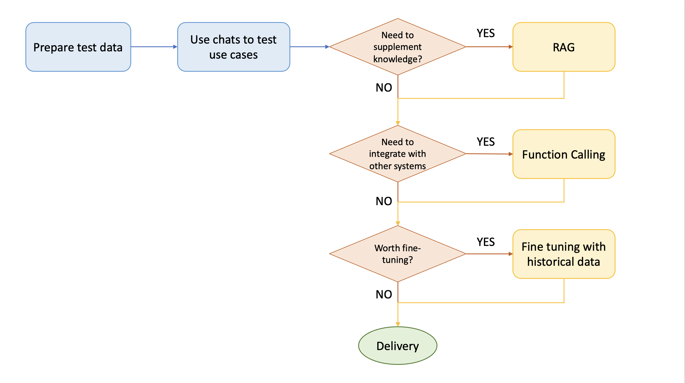

Demystifying LLM Strategies: A Journey through Prompt Engineering, Functional Calling, RAG, and Fine-Tuning
==============
***One article to cover what they are, how they are related and how to choose one***

**Author:** *[Selina Li](https://medium.com/@lizhuohang.selina), [Tianyi Li](https://medium.com/@bianbianzhu123)*

In the ever-evolving landscape of Generative AI, certain buzzwords have become commonplace: “Prompt Engineering,” “Functional Calling,” “RAG,” and “Fine-Tuning.” Perhaps you’ve encountered them in discussions, blog posts, or conference presentations. Like you, I’ve explored each of these concepts over the past year, but until recently, they remained as separate dots in my mind.

Recently these separate dots got connected after I attended a virtual seminar by [Sunner](https://github.com/sunner), the creator of the open-source project [ChatAll](https://github.com/sunner/ChatALL). I cannot wait to share this newfound clarity with you.

This article will describe what each LLM strategy does and how they relate to each other, also simply covering how we can choose among them for our best use case.

# Recap on how LLM works

Before we go further, let's briefly recap on how LLM generates results.

In layman's terms, it is like finishing a cloze test: 
- Given a sequence of words, LLM refers to a dictionary of words, and evaluates the likelihood that each of the words comes as the next
- The word with the highest likelihood will be chosen and filled into the space
- The above steps repeat until there is no more space to fill in

Going deeper, LLMs read through all the human knowledge and record the likelihood of seeing each token as the next. This process is "training".

LLM finishes the cloze test based on the given words - this process is "inference".

Traing and Inference are the two core processes that enable LLM to work.

This explains why sometimes LLM confidently speaks wrong - the human knowledge that it was trained on might not include sufficient information about the topic.

Therefore, to enable LLM to function as desired, **we will need to give LLM more context information about the topics that we want it to talk about**.

All the strategies including Function Calling, RAG and Fine tuning are around this. They are different approaches to provide more context useful information to LLMs. 

# What are the strategies, and how are they related to each other?

## Pure Prompt

The first strategy is pure prompting. By name it explains how this strategy works: 
- You issue a query to the LLM
- The LLM provides a response

This is simply "chatting". You are basically chatting with LLM like chatting with another human.

We are using this strategy everyday when we chat with LLM-powered ChatBots such as ChatGPT, Gemini, and Copilot. 

## Agent + Function Calling

The second strategy is Agent plus Function Calling.

This is how this strategy works:
- You **issue a query** to the LLM
- Instead of answering you in a straight way, the LLM will refer to a given **tookits**, and **select a tool** from it to perform some tasks first
    - Why would the LLM do so? Could be because it needs some extra information, or it was educated to fulfill some pre-requisites before answering your questions. 
    - The tookits here are a list of pre-writen functions or API calls
    - The LLM will decide on the tool that it wants to use, and return the name of the tool (i.e. function name)
- Upon receiving the tool name (function name), you **use the tool (call the function)** to perform the task as desired by the LLM, and **get some useful information**
- You **pass the useful information back** to the LLM, and the LLM uses the information to generate a response back to your original query

If this still sounds abstract, let's look at an example:
- You issue a query to the LLM as a travel agent e.g. **"Plan me a trip for the incoming Christmas holiday in Bali island"**
- The LLM decides that in order to plan a good trip for you, it requires your budget information first. It refers to a given toolkit which includes multiple tools including `get_budget()`, `get_destination_info()`, `get_weather()` and so on, and decides it will use the tool named `get_budget()`
- Upon receiving the suggested tool name, you (as the application) call the function `get_budget()`. Let's say it returns you a budget of **AUD1000**.
- You pass the **AUD1000 budget information** to the LLM, and the LLM generate a list of travel plan for you based on your budget

Note that function calling is **not limited to single one function**. In this example, the LLM may decide it also requires weather information and the destination information, thus it may decide to use the other tools `get_destination_info()` and `get_weather()` as well. What functions and how many functions will be called depend on different factors including:
- What functions are given in the toolkit
- What LLM decides based on the context including system promt, user prompt and historical user information
- etc.

As you might have noticed, this process involves **LLM (which provides any possible answers based on its knowledge)** as well as **functions/API calls (which were pre-written with preset logics)**. 
- Different from the traditional approach to use hard-coded logics (e.g. if else) to decide when to call which function/API, this process utilizes the power of LLM to dynamically decide. 
- Different from pure prompting, this process enables LLM to integrate with external systems through function/API calling.

## RAG (Retrieval Augmented Generation)

The third strategy is RAG.

On top of the toolkit of functions/APIs as mentioned in above Agent + Function Calling, we can also supply a knowledge base to the LLM. The knowledge base is generally implemented through a **vector database**.

As preparations:
- We **collect documents** which are related to certain topics that we want to enable LLMs to talk about in an accurate manner
- We break them into **smaller chunks**
- We then create **embeddings** (i.e. numeric representations) for each of the chunks, and store them in the **Vector Database**

This is how this strategy works:
- You **issue a query** to the LLM
- The application will **retrieve information from the knowledge base which are most relevant to the user query**. This is the process of **"retrieval"**
- The retrieved information will be passed along into the final prompt to the LLM. This is the process of **"augment"** (augmenting of the prompt)
- LLM generates responses based on the final prompt. This is the process of **"generation"**

## Fine Tuning

The forth strategy is Fine Tuning.

Just like when you write a function, you have two ways to pass a variable to it - first, pass in a variable from argument so it can be picked up during run time; second, bake it in as a local variable within the function.

Similarly, the context knowledge that we pass in as run-time prompt in above RAG strategy, can be baked it in during the model training as an alternative. This is the case of fine tuning.

Imagine if you are a company specialised in pharmacy, you might have a huge knowledge base which are not being aware of publicly. In such a case, you can choose a foundation LLM and fine tune it by baking in the knowledge base as part of the new model itself.

# When to use which strategy?

Despite the "case by case" golden answer, we would like to provide some more clues here as shared by Sunner.

You might find RAG sufficient to resolve 70% to 80% of use cases given its core advantages:
- Easy to keep up-to-date as we just need to keep the documents and vector database udpate to date
- Lower cost

Situations where Fine-tuning is considered:
1. Stability of model output is of great significance
2. With a large number of users, reducing inference costs is of great significance
3. Generation speed of LLMs is of great significance
4. Private hosting is a must

Below diagram is not a golden rule but can provide some guidance: 

