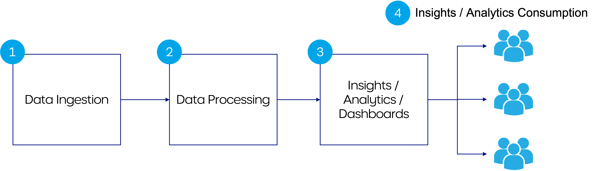
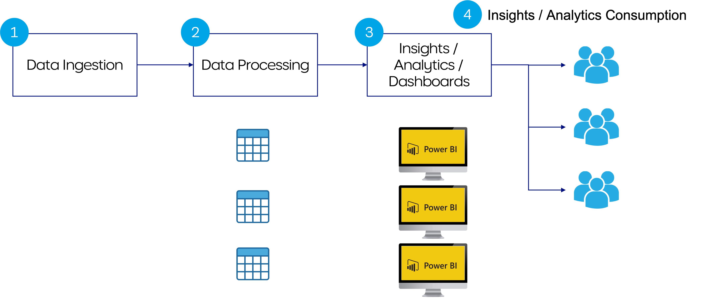
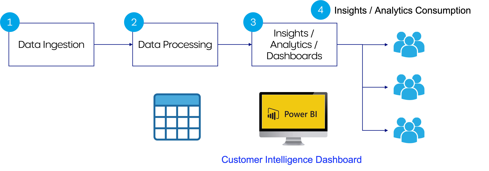
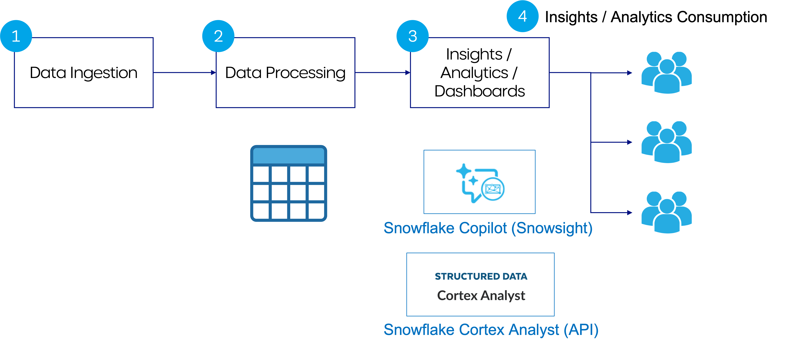
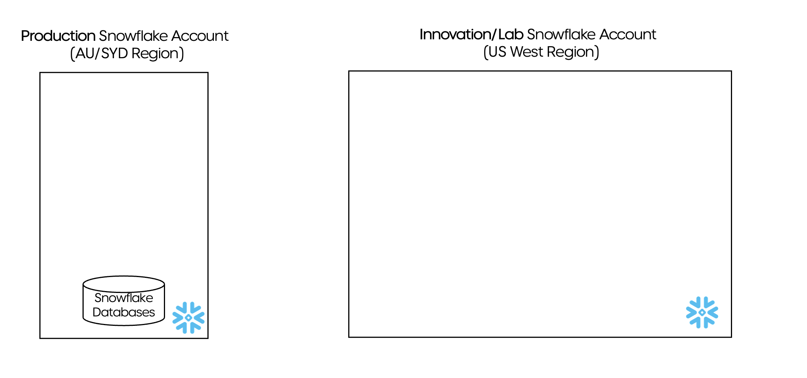

LLM Assistants to Generate Analysis on Structured Data
Using Snowflake Copilot and Cortex AI

# Use Case

At enterprises, a typical data flow looks as below:

Data from different source systems get ingested / compiled into a central data platform. Data processing happens next to transform the data into a good shape. Then analysts work on SQL queries and dashboards to create insights and analytics which will be consumed by business users. 

While there is a space to improve on every single step, we observed something interesting with step 2, 3 and 4 for analysis generation and consumption. We have gone through several iterations of the approach for these steps.

## Iteration 1

Previously, for each business use case we built individual tables which corresponds to individual dashboards. 

As time goes on, we found some issues with this approach:
- First, as we have more and more dashboards, though we have all these dashboards located at a central repo, users still find it hard to locate the insights that they exactly need; 
- Second, it turns out challenging for users to correlate the insights across different dashboards. For example, we have a dashboard A reporting on marketing campaign A and dashboard B on campaign B. When a business user comes asking "how many customers were not part of campaign A but are now shopping with us through campaign B?", neither of the existing dashboards can address this particular question;
- Both above issues contributed to our third issue - our data analysts turned out receiving quite a lot of ad-hoc requests from business users, and can hardly focus on what they are supposed to complete.

## Iteration 2

To resolve these issues, we came up with Iteration 2. We spent quite a lot of efforts in consolidating and creating a single point of reference for both the data layer and dashboard layer

First, we created a unified data asset by properly modelling the existing datasets from various source systems. This unified data layer serves as a golden data asset for downstream to consume;
Second, we consolidated the different dashboards into a comprehensive intelligence dashboard. This dashboard plugs into the unified data layer and was designed in a way which can answer as many questions from business users as possible.

This approach is helpful in reducing the number of ad-hoc requests as we can point users to the comprehensive intelligence dashboard for the answer to their questions. However, no matter how much effort we put in collecting user requirement, designing and iterating the dashboard, there is always question from business user which cannot be directly addressed by the dashboard.

## Iteration 3

In the latest iteration 3, we are looking at a "smarter" way on top of Iteration 2.

When a user asks a question, we hope to automatically generate corresponding insights and analytics, with minimum requirement on human support. 

In the latest experiments, we tried utilizing Snowflake Copilot and Cortex AI functionalities to help achieve this.

# Access to Snowflake Copilot and Cortex AI Functionality

At the time of our experiments, Snowflake Copilot is under public preview and available in the following regions:
- AWS us-east-1
- AWS us-west-2
- AWS eu-central-1

Snowflake Cortex Analyst is under private preview.

To gain access to the features, we opened a Snowflake innovation account in US West region so we can access Snowflake Copilot. We also had the help from Snowflake team to enable Cortex Analyst in the account.

While our data stays in the production account in Australia Sydney region, we can access the new features in the innovation account in US West region:

As these Snowflake features roll out to other regions including Australia Sydney, enterprises might be able to the access them within existing account(s).

# LLM Assistant using Snowflake Copilot

# LLM Assistant using Snowflake Cortex Analyst