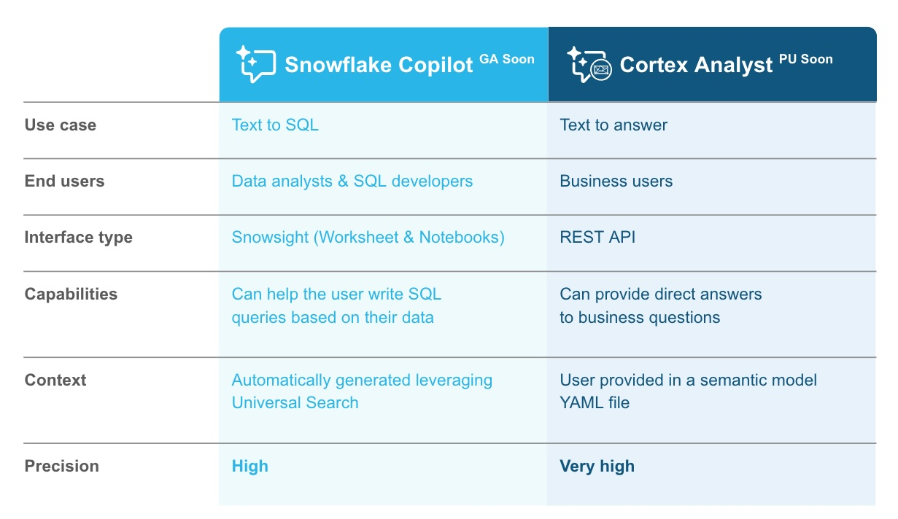

LLM Assistants to Generate Analysis on Structured Data
Using Snowflake Copilot and Cortex AI

# Use Case

At enterprises, a typical data flow looks as below:

Data from different source systems get ingested / compiled into a central data platform. Data processing follows next to transform the data into a good shape. Then analysts work on SQL queries and create dashboards to generate insights which will be consumed by business users. 

While there is a space to improve on every single step, we observed something interesting with the steps (step 3 and step 4) for analysis generation and consumption. We have gone through several iterations of the approach.

## Iteration 1

Previously, for each business use case we built individual tables which corresponds to individual dashboards. 

We found some issues with this approach as time goes on:
- First, as we have more and more dashboards (depite the fact that we have all these dashboards located at a central repo), users still find it difficult to locate the insights that they exactly need; 
- Second, it is challenging for users to correlate the insights across different dashboards. For example, we have a dashboard A reporting on marketing campaign A and dashboard B on campaign B. When a business user comes asking "how many customers were not part of campaign A but are now shopping with us through campaign B?", neither of the existing dashboards can address this particular question;
- Both above issues contributed to our third issue - our data analysts turned out receiving quite a lot of ad-hoc requests from business users, which distracted their attention from the sprint focus.

## Iteration 2

To resolve these issues, we came up with Iteration 2. We took an initiative to consolidate and create a single point of reference for both the data layer and dashboard layer

First, we created a **unified data asset** by modelling the existing datasets from various source systems. This unified data layer serves as a golden data asset for the downstream to consume;

Second, we consolidated the different dashboards into **a comprehensive intelligence dashboard**. This dashboard is connected to the unified data layer and was designed in a way which could answer as many questions from business users as possible.

This approach works well and it helps reduce the number of ad-hoc requests as we can point users to the comprehensive intelligence dashboard to answer their questions. 

However, no matter how much effort we put in collecting user requirements, designing and improving the dashboard, there are always questions from business users which cannot be directly addressed by the dashboard.

## Iteration 3

In the latest iteration 3, we are looking at a "smarter" way on top of Iteration 2.

We are looking for a solution which can be working in this way - when a user asks a question, the solution can automatically generate corresponding insights and analytics, with minimum effort required by human. 

In a latest experiment, we tried utilizing [Snowflake Copilot](https://docs.snowflake.com/en/user-guide/snowflake-copilot) and [Snowflake Cortex Analyst](https://www.snowflake.com/en/data-cloud/cortex/) to help achieve this.

# Snowflake Copilot and Snowflake Cortex Analyst

Both [Snowflake Copilot](https://docs.snowflake.com/en/user-guide/snowflake-copilot) and [Snowflake Cortex Analyst](https://www.snowflake.com/en/data-cloud/cortex/) are Snowflake AI functionalities empowered by Large Language Models.

[Snowflake Copilot](https://docs.snowflake.com/en/user-guide/snowflake-copilot) sits inside the **Snowflake UI - Snowsight**. Users can interact with Copilot in SQL Worksheets and Snowflake Notebooks. It helps data analysts and SQL developers accelerate development by turning text into SQL.

[Snowflake Cortex Analyst](https://www.snowflake.com/en/data-cloud/cortex/) serves as a **REST API** which can be used in any application. When users interact with these applications, they can ask questions and get back answers that they need.

# Access to Snowflake Copilot and Cortex Analyst

At the time of our experiment, **Snowflake Copilot** is under public preview and available in the following regions:
- AWS us-east-1
- AWS us-west-2
- AWS eu-central-1

**Snowflake Cortex Analyst** is under private preview.

To gain access to the features, we opened a Snowflake **Innovation Account** in US West region so we can access **Snowflake Copilot**. 

We also had the help from Snowflake team to enable **Cortex Analyst** in the account.

While our data stays in the production account in Australia Sydney region, we can access the new features in the innovation account in US West region:

As these Snowflake features roll out to other regions including Australia Sydney, enterprises might be able to the access them within existing account(s).

# LLM Assistant using Snowflake Copilot

To utilize Snowflake Copilot, we need to make sure we have the dataset (at least the schema of the dataset) located within the same Snowflake Account.

For the experiment, we have 

# LLM Assistant using Snowflake Cortex Analyst

