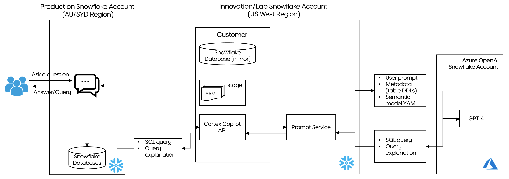

LLM Assistants to Generate Analysis on Structured Data
Using Snowflake Copilot and Cortex AI


# Use Case

At enterprises, a typical data flow looks as below:


Data from different source systems get ingested / compiled into a central data platform. Data processing follows next to transform the data into a good shape. Then analysts work on SQL queries and create dashboards to generate insights which will be consumed by business users. 

While there is a space to improve on every single step, we observed something interesting with the steps (step 3 and step 4) for analysis generation and consumption. We have gone through several iterations of the approach.

## Iteration 1

Previously, for each business use case we built individual tables which corresponds to individual dashboards. 


We found some issues with this approach as time goes on:
- First, as we have more and more dashboards (depite the fact that we have all these dashboards located at a central repo), users still find it difficult to locate the insights that they exactly need; 
- Second, it is challenging for users to correlate the insights across different dashboards. For example, we have a dashboard A reporting on marketing campaign A and dashboard B on campaign B. When a business user comes asking "how many customers were not part of campaign A but are now shopping with us through campaign B?", neither of the existing dashboards can address this particular question;
- Both above issues contributed to our third issue - our data analysts turned out receiving quite a lot of ad-hoc requests from business users, which distracted their attention from the sprint focus.

## Iteration 2

To resolve these issues, we came up with Iteration 2. We took an initiative to consolidate and create a single point of reference for both the data layer and dashboard layer


First, we created a **unified data asset** by modelling the existing datasets from various source systems. This unified data layer serves as a golden data asset for the downstream to consume;

Second, we consolidated the different dashboards into **a comprehensive intelligence dashboard**. This dashboard is connected to the unified data layer and was designed in a way which could answer as many questions from business users as possible.

This approach works well and it helps reduce the number of ad-hoc requests as we can point users to the comprehensive intelligence dashboard to answer their questions. 

However, no matter how much effort we put in collecting user requirements, designing and improving the dashboard, there are always questions from business users which cannot be directly addressed by the dashboard.

## Iteration 3

In the latest iteration 3, we are looking at a "smarter" way on top of Iteration 2.

We are looking for a solution which can be working in this way - when a user asks a question, the solution can automatically generate corresponding insights and analytics, with minimum effort required by human. 

In a latest experiment, we tried utilizing [Snowflake Copilot](https://docs.snowflake.com/en/user-guide/snowflake-copilot) and [Snowflake Cortex Analyst](https://www.snowflake.com/en/data-cloud/cortex/) to help achieve this.


# Snowflake Copilot and Snowflake Cortex Analyst

Both [Snowflake Copilot](https://docs.snowflake.com/en/user-guide/snowflake-copilot) and [Snowflake Cortex Analyst](https://www.snowflake.com/en/data-cloud/cortex/) are Snowflake AI functionalities empowered by Large Language Models.

[Snowflake Copilot](https://docs.snowflake.com/en/user-guide/snowflake-copilot) sits inside the **Snowflake UI - Snowsight**. Users can interact with Copilot in SQL Worksheets and Snowflake Notebooks. It helps data analysts and SQL developers accelerate development by turning text into SQL.

[Snowflake Cortex Analyst](https://www.snowflake.com/en/data-cloud/cortex/) serves as a **REST API** which can be used in any application. When users interact with these applications, they can ask questions and get back answers that they need.


# Access to Snowflake Copilot and Cortex Analyst

At the time of our experiment, **Snowflake Copilot** is under public preview and available in the following regions:
- AWS us-east-1
- AWS us-west-2
- AWS eu-central-1

**Snowflake Cortex Analyst** is under private preview.

To gain access to the features, we opened a Snowflake **Innovation Account** in US West region so we can access **Snowflake Copilot**. 

We also had the help from Snowflake team to enable **Cortex Analyst** in the account.

# LLM Assistant using Snowflake Copilot

For the experiment, within the innovation account, we have an existing sample dataset `INNOVATION_BDS_ENTERPRISE.PUBLISHED_DATA.RETAIL_TRANSACTION_DATASET`.


We can use Snowflake Copilot by following these steps:

1. Create a new worksheet or open an existing worksheet.

2. Select "Ask Copilot" in the lower-right corner of the worksheet. 

The Snowflake Copilot panel opens on the right side of the worksheet.


3. Go to the selector below the Snowflake Copilot message box, select the database and schema of our sample dataset


4. In the message box, type in our question and then select the send icon or press Enter to submit it. Snowflake Copilot provides a response in the panel.


5. If the response from Snowflake Copilot includes SQL statements:
- Select Run to run the query. This adds the query to our worksheet and runs it.
- Select Add to edit the query before running it. This adds the query to our worksheet, which we can further edit and run.


Snowflake Copilot works great while we see some space to improve the solution:
1. To interact with Copilot, the user needs access to Snowsight UI. Data analysts and SQL developers will definitely have the access, but many our business users do not;
2. To utilize Snowflake Copilot, we need to make sure we have the dataset (at least the schema of the dataset) located within the same Snowflake Account. But in our real use case, our dataset is located in Production Account which is separate to this Innovation Account;
3. Copilot is generating the SQL based on the schema of our dataset. We noticied that the SQL query generated is not 100% correct, partially because we have not provisioned detailed descriptions for tables and columns as part of Snowflake schema and DDL. Thus when Snowflake Copilot generates the SQL, it does not have sufficient information to ground with.

To further improve the solution, we experiment with Snowflake Cortex Analyst as below.

# LLM Assistant using Snowflake Cortex Analyst

## Solution Design


We will walk through the solution step by step.

## Prerequisites: 

1. Enable Cortex Analyst Endpoint within **Innovation Account**. 

As mentioned above, we had the help from Snowflake team to enable **Cortex Analyst** endpoint in our Innovation Account.

2. Prepare table within another **Production Account**.

Our dataset (a snowflake table) used for this solution is sitting under another Production Account.

While our data stays in the production account in Australia Sydney region, we can access the new features in the innovation account in US West region.


As these Snowflake features roll out to other regions including Australia Sydney, enterprises might be able to the access them within existing account(s).

3. Create an empty table within **Innovation Account** to mirror the table within **Production Account**.


Create a database, schema and table in **Innovation Account** with the same names as the ones in the **Production Account**. Also make sure the table has exactly the same schema and columns. Leave this table as empty.

This empty table will be used to enable Cortex Analyst to generate the correct SQL query. But we won't be applying the returned SQL query to the empty table in the **Innovation Account**, instead as part of our Streamlit application, we will apply the SQL to our original table within the **Production Account**.


## Step 1: Generate a semantic model for the dataset


As a first step of this solution, we need to generate a semantic model for our dataset in the Production Account.

We did this utilizing the [semantic-model-generator](https://github.com/Snowflake-Labs/semantic-model-generator) provided by [Snowflake Labs](https://github.com/Snowflake-Labs). Detailed instructions are provided by this git repo regarding how to use it to generate a semantic model for our Snowflake table.

For example, using this git repo, we can generate below semantic model for a [sample retail transaction dataset](https://www.kaggle.com/datasets/fahadrehman07/retail-transaction-dataset):
```
name: retail_transaction
tables:
  - name: RETAIL_TRANSACTION_DATASET
    description: '  ' # <FILL-OUT>
    base_table:
      database: INNOVATION_BDS_ENTERPRISE
      schema: PUBLISHED_DATA
      table: RETAIL_TRANSACTION_DATASET
    filters:
      - name: '  ' # <FILL-OUT>
        synonyms:
          - '  ' # <FILL-OUT>
        description: '  ' # <FILL-OUT>
        expr: '  ' # <FILL-OUT>
    dimensions:
      - name: PRODUCT_ID
        synonyms:
          - '  ' # <FILL-OUT>
        description: 'Unique identifier for each product.'
        expr: PRODUCT_ID
        data_type: TEXT
        sample_values:
          - C
          - A
          - D
          - B
      - name: PAYMENT_METHOD
        synonyms:
          - 'methods of payment'
        description: 'The method used by the customer to make the payment.'
        expr: PAYMENT_METHOD
        data_type: TEXT
        sample_values:
          - Cash
          - PayPal
          - Debit Card
          - Credit Card
      - name: STORE_LOCATION
        synonyms:
          - 'store address'
        description: 'The location where the transaction took place.'
        expr: STORE_LOCATION
        data_type: TEXT
        sample_values:
          - "176 Andrew Cliffs\nBaileyfort, HI 93354"
          - "11635 William Well Suite 809\nEast Kara, MT 19483"
          - "910 Mendez Ville Suite 909\nPort Lauraland, MO 99563"
          - "87522 Sharon Corners Suite 500\nLake Tammy, MO 76234"
          - "0070 Michelle Island Suite 143\nHoland, VA 80142"
          - "8492 Jonathan Drive\nNorth Robertshire, TN 67532"
          - "USNV Harrell\nFPO AA 62814"
          - "528 Justin Expressway Apt. 336\nCabreraborough, SD 17915"
          - "189 Wright Mews\nMartinfurt, MO 75932"
          - "388 Matthew Lane Apt. 592\nWest Andreachester, IN 96537"
      - name: STATE
        synonyms:
          - '  ' # <FILL-OUT>
        description: 'State of the store where the transaction took place. Derived from STORE_LOCATION.'
        expr: STATE
        data_type: TEXT
        sample_values:
          - HI
          - MT
          - MO
          - VA
          - TN
          - AA
          - WV
          - IN
          - AP
          - NE
      - name: POSTCODE
        synonyms:
          - 'zipcode'
        description: 'Postcode of the store where the transaction took place. Derived from STORE_LOCATION.'
        expr: POSTCODE
        data_type: TEXT
        sample_values:
          - '93354'
          - '19483'
          - '76234'
          - '80142'
          - '67532'
          - '62814'
          - '72610'
          - '17915'
          - '05999'
          - '21025'
      - name: PRODUCT_CATEGORY
        synonyms:
          - '  ' # <FILL-OUT>
        description: 'Category to which the product belongs.'
        expr: PRODUCT_CATEGORY
        data_type: TEXT
        sample_values:
          - Books
          - Home Decor
          - Electronics
          - Clothing
    time_dimensions:
      - name: TRANSACTION_TIMESTAMP
        synonyms:
          - 'transaction date'
          - 'transaction date time'
          - 'transaction date and time'
        description: 'Date and time when the transaction occurred.'
        expr: TRANSACTION_TIMESTAMP
        data_type: TIMESTAMP_NTZ
        sample_values:
          - '2023-12-26 12:32:00'
          - '2023-08-05 00:00:00'
          - '2024-03-11 18:51:00'
          - '2023-10-27 22:00:00'
          - '2023-12-22 11:38:00'
          - '2023-08-15 04:24:00'
          - '2023-12-26 05:32:00'
          - '2023-10-11 06:48:00'
          - '2024-02-27 11:13:00'
          - '2023-11-05 01:46:00'
    measures:
      - name: CUSTOMER_ID
        synonyms:
          - 'customer number'
        description: 'Unique identifier for each customer.'
        expr: CUSTOMER_ID
        data_type: NUMBER
        sample_values:
          - '109318'
          - '993229'
          - '579675'
          - '799826'
          - '121413'
          - '463050'
          - '888163'
          - '843385'
          - '839609'
          - '184135'
      - name: QUANTITY
        synonyms:
          - 'number of pieces'
        description: 'The number of units purchased for a particular product.'
        expr: QUANTITY
        data_type: NUMBER
        sample_values:
          - '7'
          - '4'
          - '8'
          - '5'
          - '3'
          - '6'
          - '2'
          - '1'
          - '9'
      - name: PRICE
        synonyms:
          - 'unit price'
        description: 'The unit price of the product.'
        expr: PRICE
        data_type: NUMBER
        sample_values:
          - '80.07984415'
          - '75.19522942'
          - '31.52881648'
          - '98.88021828'
          - '93.18851246'
          - '13.12193739'
          - '56.02516419'
          - '23.85798105'
          - '43.69259776'
          - '98.70968076'
      - name: DISCOUNT_APPLIED_PERCENTAGE
        synonyms:
          - 'discount'
          - 'discount percent'
          - 'discount percentage'
          - 'percentage of discount'
        description: 'Percentage of discount applied on the transaction'
        expr: DISCOUNT_APPLIED_PERCENTAGE
        data_type: NUMBER
        sample_values:
          - '18.677099500'
          - '14.121365020'
          - '15.943700660'
          - '6.686336780'
          - '4.030095691'
          - '10.888768360'
          - '16.295126710'
          - '6.344305684'
          - '18.703997250'
          - '7.640606649'
      - name: TOTAL_AMOUNT
        synonyms:
          - 'sales'
          - 'sales amount'
          - 'total sales'
          - 'total sales amount'
        description: 'Total amount paid for the transaction. Calculated by quantity * price * (1 - discount_applied_percentage/100)'
        expr: TOTAL_AMOUNT
        data_type: NUMBER
        sample_values:
          - '455.862763800'
          - '258.306546400'
          - '212.015650900'
          - '461.343769400'
          - '626.030483700'
          - '144.609223300'
          - '76.885907450'
          - '419.766052100'
          - '96.977924650'
          - '234.012017500'
```

## Step 2: Upload the semantic model to stage


After we've got our semantic model, next step is to upload it to a stage within the Innovation Account where the Cortex Analyst is located.

We created a database named `semantic_model`, a schema named `definition` and a stage named `my_stage` sitting under the schema.

Note: the snowflake role we used in our Streamlit app (see step below) should be able to access the database, schema and stage that we created in this step.

## Step 3: Create a Streamlit app

This step is to create a Streamlit app for users to interact with.


Snowflake provided 2 options: 
- Option 1: Create a standalone Streamlit app
- Option 2: Create a Streamlit in Snowflake app

We went with option 1 in this case because our dataset is sitting within a separate account. After getting the SQL query from Cortex Analyst within Innovation Account, we would like to apply the query to dataset in our Production Account. With a standalone Streamlit App, it is easier for us to construct the application across accounts.

We created the Streamlit app by referring to a documentation provided by Snowflake. As Cortex Analyst feature is still in Private Preview, we are not sharing details in here as the instructions and codes are subject to change and review by Snowflake. If you are interested in the details, please reach out to your Snowflake Account Manager and Solution Architect.

Once the feature goes to Public Preview, the code will be available as part of Snowflake official documentation. 

## Step 4: Interact with Streamlit app


When a user asks a question, 